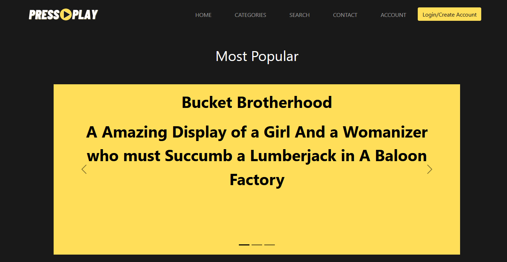
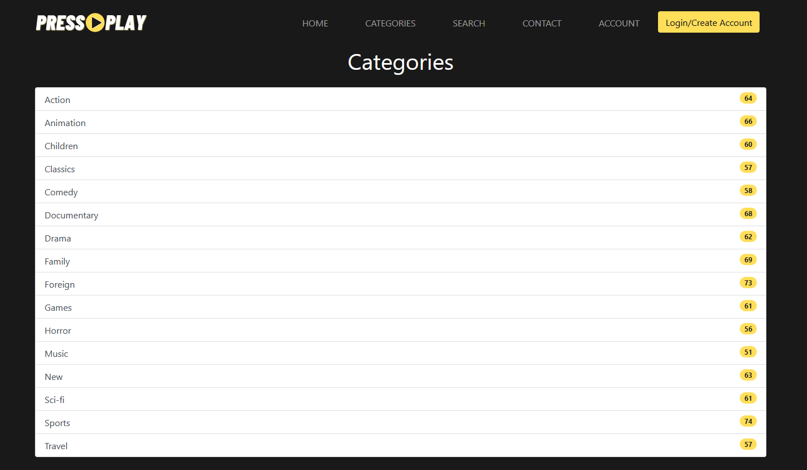
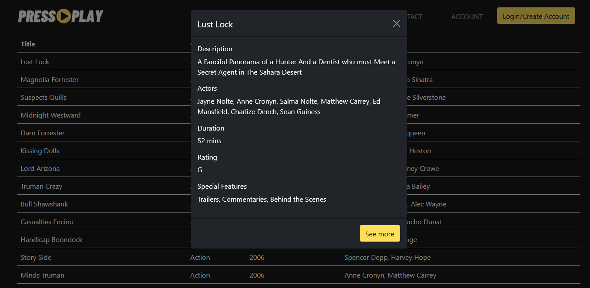
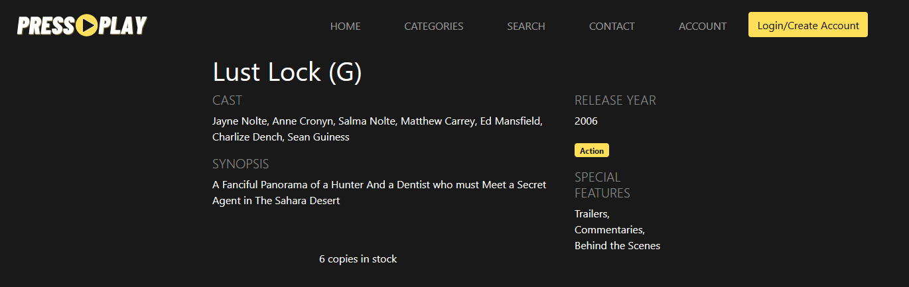
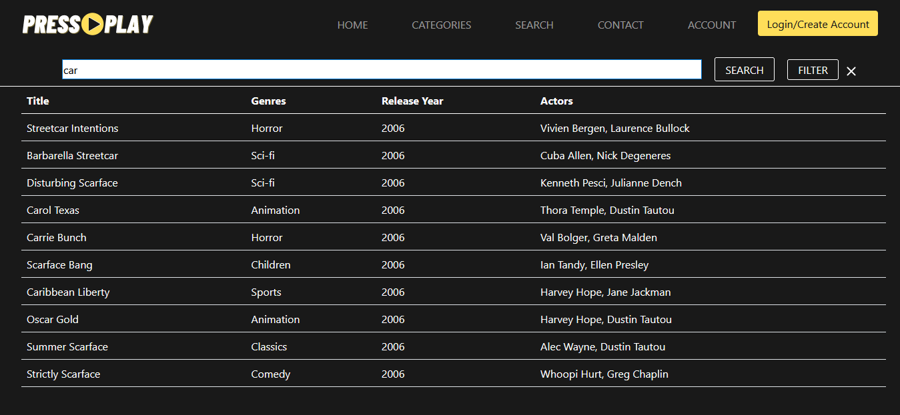
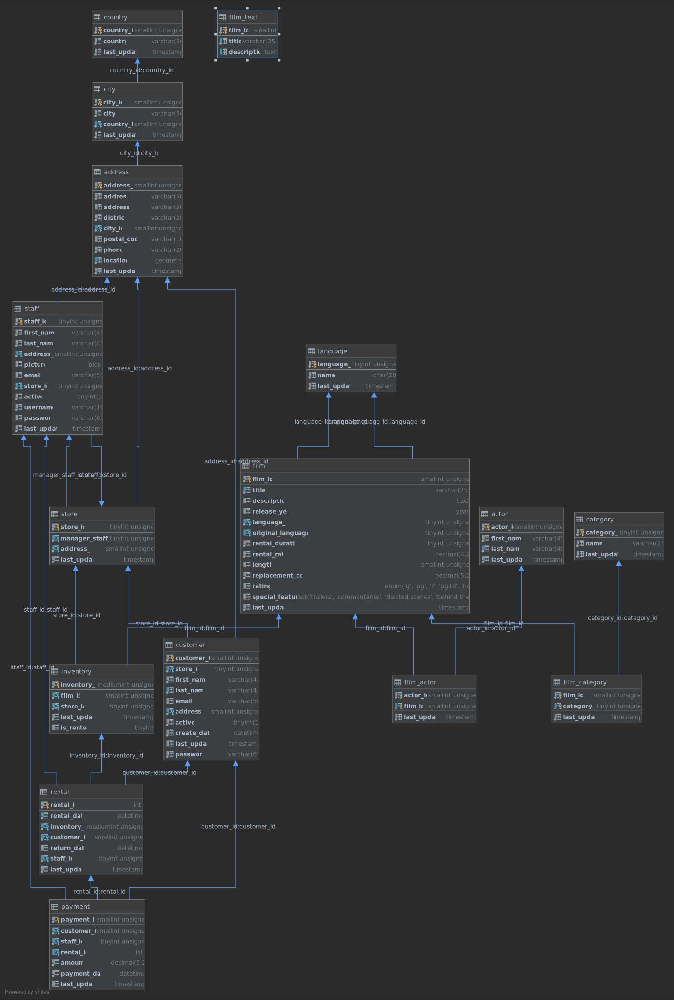

# 

A group project assigned By Sparta Global to create a 3-tier application that acts as a Film rental service.

<li>IDE : IntelliJ Ultimate</li>
<li>Framework: Spring Boot</li>
<li>View: Thymeleaf templating</li>
<li>Database: AWS hosted MySQL database</li>
<li>Dependancy Management: Maven</li>
<li>Version Control: Github</li>
<li>Project Board: Github hosted</li>

# IMPORTANT

For security reasons, the application.properties file needed for the database connection to work is not included with this project,
but you can easily add the file with the following inside:

<li>spring.datasource.url=jdbc:mysql:// <i> where the MySQL database is hosted </i> /sakila</li>
<li>spring.datasource.username= <i> insert username </i></li>
<li>spring.datasource.password= <i> insert password </i></li>
<li>spring.jpa.properties.hibernate.dialect=org.hibernate.spatial.dialect.mysql.MySQL56InnoDBSpatialDialect</li>

## screenshots

  
  
  
  
  

## Entity Relationship Diagram:

